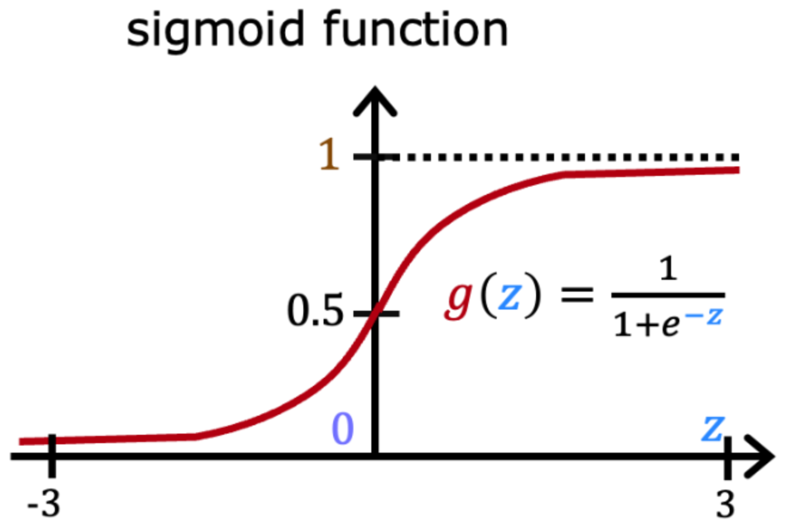
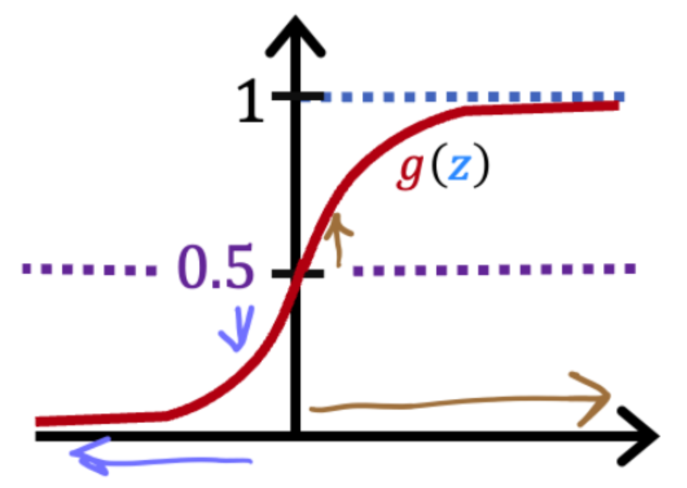

# 小测

## 第一题

哪个是分类任务的示例？

- [ ] 根据患者的血压，确定应给患者开多少降压药物（剂量以毫克为单位）。
- [x] 根据每个肿瘤的大小，确定每个肿瘤是否是恶性（癌）。
- [ ] 根据患者的年龄和血压，确定应给患者开多少血压药物（以毫克为单位）。

## 第二题

回想一下Sigmoid函数是$g(z)=\frac{1}{1+e^{-z}}$

如果z是一个大的正数，那么：

- [ ] g(z)靠近-1（-1）
- [ ] g(z)会靠近零（0）
- [x] g(z)靠近1（1）
- [ ] g(z)会靠近0.5

## 第三题

猫照片分类模型如果是猫则预测为1，如果不是猫则预测为0。对于特定照片，逻辑回归模型输出$g(z)$（0到1之间的数字）。
以下哪一个是决定是否预测它是否是猫的合理标准？

- [ ] 如果$g(z)<0.5$，则预测它是一只猫
- [ ] 如果$g(z)=0.5$，则预测它是一只猫
- [ ] 如果$g(z)<0.7$，则预测它是一只猫
- [x] 如果$g(z)>=0.5$，则预测它是一只猫

## 第四题

真假？无论您使用什么特征（包括如果使用多项式特征），逻辑回归学习到的决策边界都将是线性决策边界。

- [x] 错误的
- [ ] 真的