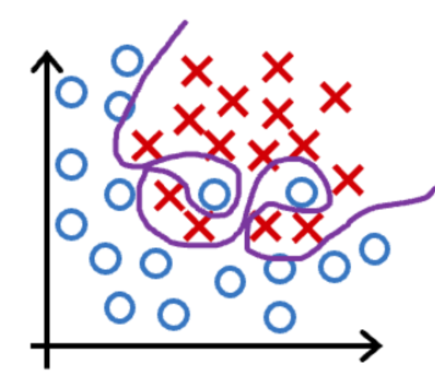
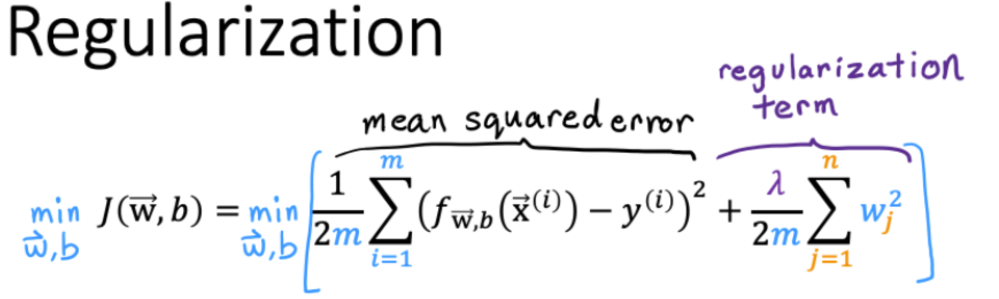

# 小测

## 第一题

以下哪项可以解决过度拟合问题？

- [x] 收集更多训练数据
- [ ] 删除一组随机的训练示例
- [x] 应用正则化
- [x] 选择更相关的特征的子集。

## 第二题

您将具有多项式特征的逻辑回归拟合到数据集，您的模型如下所示。

你会得出什么结论？（选一个）

- [ ] 该模型具有高偏差（欠拟合）。因此，添加数据可能会有所帮助
- [x] 该模型具有高方差（过拟合）。因此，添加数据可能会有所帮助
- [ ] 该模型具有高偏差（欠拟合）。因此，添加数据本身不太可能有太大帮助。
- [ ] 该模型具有高方差（过拟合）。因此，添加数据本身不太可能有太大帮助。

## 第三题

假设您有一个正则化线性回归模型。如果增加正则化参数$\lambda$，您预计参数$w_1,w_2,\cdots,w_n$发生什么？

- [ ] 这将减少参数$w_1,w_2,\cdots,w_n$的大小
- [ ] 这将增加参数$w_1,w_2,\cdots,w_n$的大小