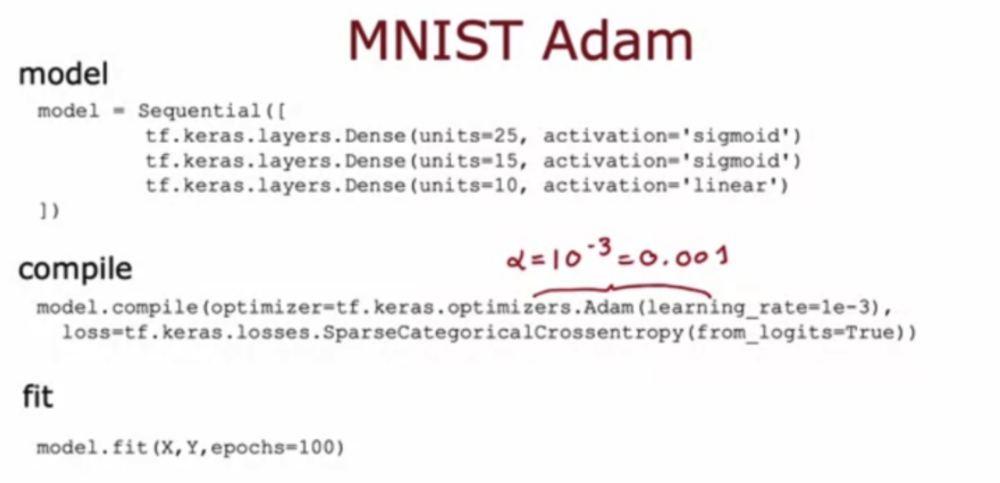
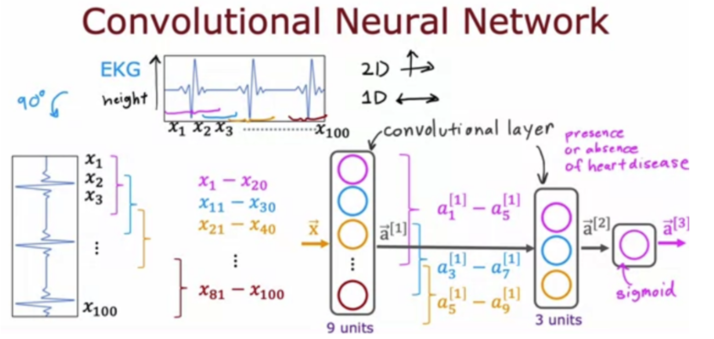

# 小测

## 第一题

Adam优化器是推荐的优化器，用于寻找模型的最佳参数。如何在TensorFlow 中使用Adam优化器？

- [ ] Adam优化器仅适用于Softmax输出。因此，如果神经网络具有Softmax输出层，TensorFlow将自动选择Adam优化器。
- [ ] 对`model.compile()`的调用默认使用Adam优化器
- [ ] 对`model.compile()`的调用会自动选择最好的优化器，无论是梯度下降、Adam还是其他。因此无需手动选择优化器。
- [x] 调用`model.compile()`时，设置`optimizer = tf.keras.optimizers.Adam(learning_rate=1e-3)`。

## 第二题

该讲座涵盖了不同的层类型，其中该层的每个神经元并不查看馈送到该层的输入向量的所有值。讲座中讨论的图层类型的名称是什么？

- [ ] 图像层
- [x] 卷积层
- [ ] 一维层或二维层（取决于输入维度）
- [ ] 全连接层