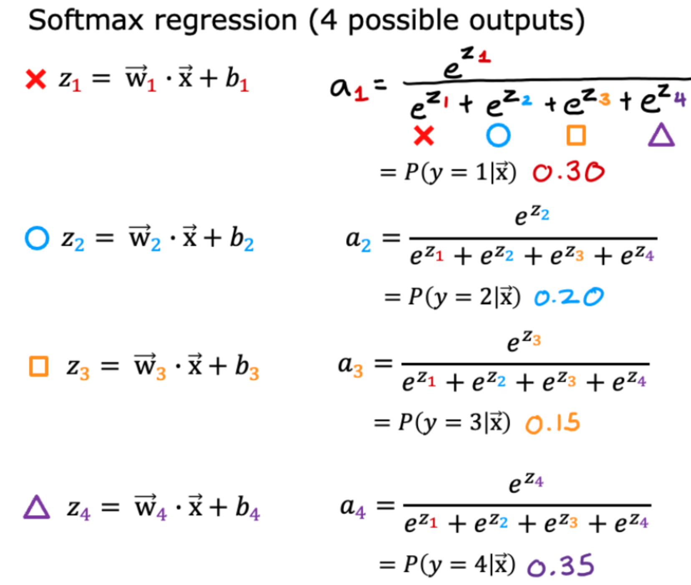
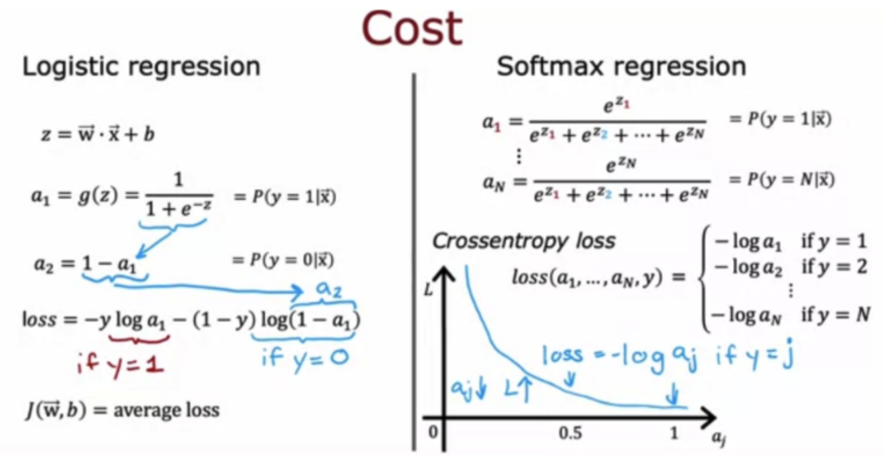

# 小测

## 第一题

对于具有4个可能输出的多类分类任务，所有激活的总和应为1。对于具有3个可能输出的多类分类任务，所有激活的总和应为……

- [ ] 它会根据输入x的不同而变化。
- [ ] 比1少
- [ ] 比1多
- [x] 1

## 第二题

对于多类分类，交叉熵损失用于训练模型。如果输出有4个可能的类别，并且对于特定的训练示例，该示例的真实类别是类别3（y=3），那么交叉熵损失会简化为什么？[提示：当@g变大时，这个损失应该变小。]

$-log(a_3)$

## 第三题

对于多类分类，推荐的实现softmax回归的方法是在损失函数中设置`from_logits=True`，同时定义模型的输出层为……

- [x] “线性”激活
- [ ] “softmax”激活