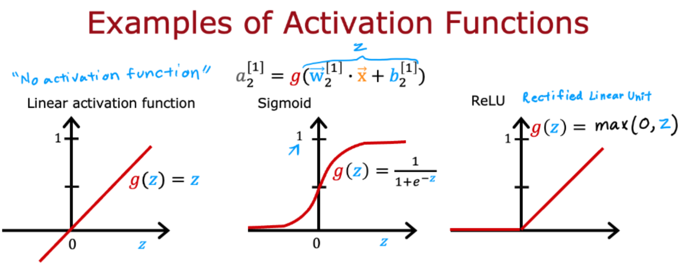
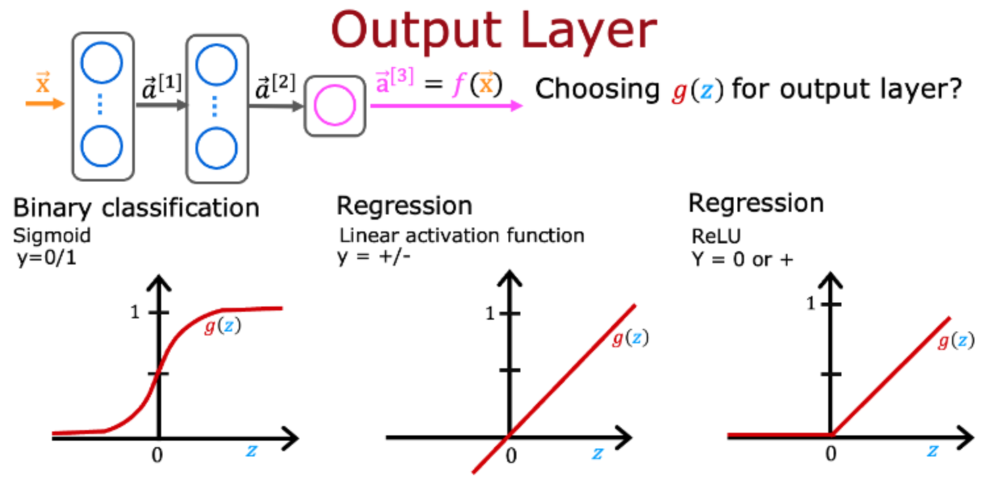

# 小测

## 第一题

以下哪种激活函数是神经网络隐藏层最常见的选择？

- [ ] 大多数隐藏层不使用任何激活函数
- [x] ReLU（整流线性单元）
- [ ] Sigmoid
- [ ] 线性

## 第二题

对于预测房价的任务，您可以为输出层选择哪些激活函数？选择适用的2个选项。

- [x] 线性
- [x] ReLU
- [ ] Sigmoid

## 第三题

真假？具有多层但没有激活函数（在隐藏层中）的神经网络是无效的；这就是为什么我们应该在每个隐藏层中使用线性激活函数。

- [x] 错误
- [ ] 正确