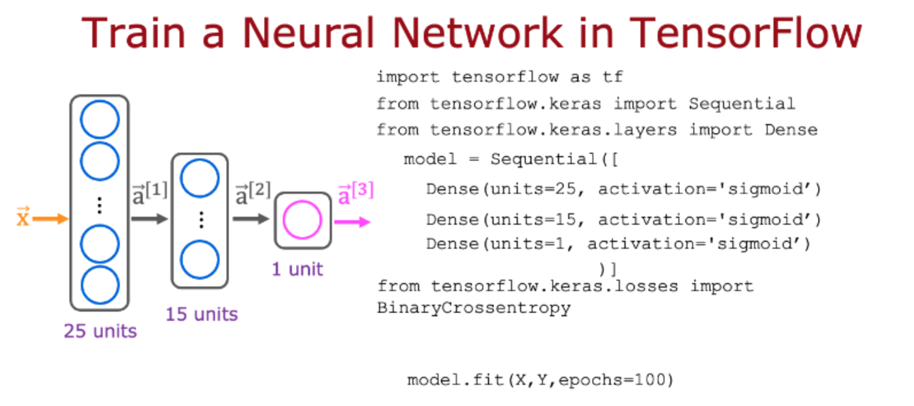
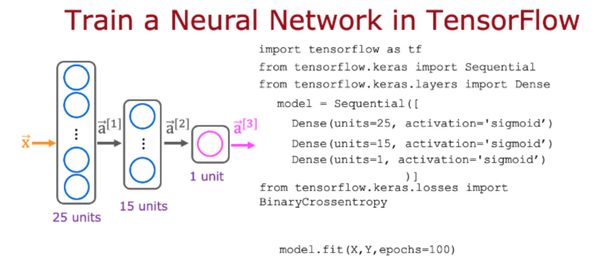

# 小测

## 第一题



以下是您在讲座中看到的一些代码：

```
model.compile(loss=BinaryCrossentropy(0)
```

对于哪种类型的任务，您会使用二元交叉熵损失函数？

- [ ] BinaryCrossentropy()不应该用于任何任务。
- [ ] 具有以下特征的分类任务：3个或更多类（类别）
- [x] 二元分类（恰好有2个类的分类）
- [ ] 回归任务（预测数字的任务）

## 第二题



这是您在讲座中看到的代码：

```python
from tensorflow.keras.layers import Dense
from tensorflow.keras.losses import BinaryCrossentropy
from tensorflow.keras.models import Sequential

X, y = list
model = Sequential(
    [Dense(units=25, activation='sigmoid'), Dense(units=15, activation='sigmoid'),
     Dense(units=1, activation='sigmoid')])
model.compile(loss=BinaryCrossentropy())
model.fit(X, y, epochs=100)
```

哪一行代码更新网络参数以降低成本？

- [ ] `model = Sequential([..])`
- [ ] 以上都不是——此代码不更新网络参数。
- [x] `model.fit(X, y, epochs=100)`
- [ ] `model.compile(loss=BinaryCrossentropy())`