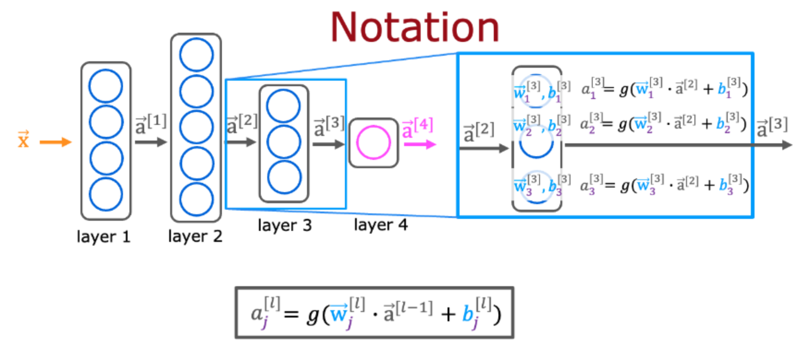
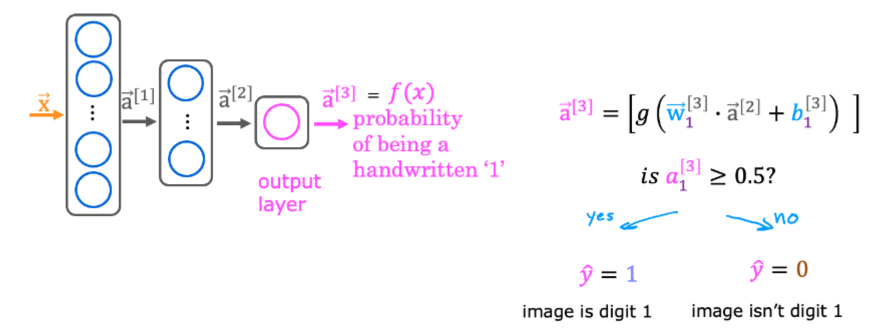

# 小测

## 第一题

对于神经网络，以下是计算第2层中第三个神经元激活的公式，给定第1层的激活向量。以下哪些说法是正确的？

- [x] 第2层的激活是使用前一层的激活来确定的。
- [x] 第2层的单元3（神经元3）的激活是使用单元3（神经元3）特有的参数向量W和b来计算的。
- [x] 单元3（神经元3）输出单个数字（标量）。
- [ ] 如果您计算第1层的激活，则前一层的激活将用a表示

## 第二题

对于讲座中讨论的手写识别的二元分类，以下哪些陈述是正确的？

- [x] 输出层中有一个单元（神经元）。
- [x] 模型的输出可以解释为手写图像是数字“1”的概率
- [x] 选择阈值后，可以将神经网络的输出转换为0或1的类别。
- [ ] 神经网络无法设计来预测手写图像是8还是9。

## 第三题

对于神经网络来说，计算第2层第三个神经元的激活的表达式是什么？请注意，这与您在讲座视频中看到的问题不同。

## 第四题

对于讲座中讨论的手写识别任务，输出是什么？

- [ ] 由多个取值在0到1之间的数字组成的向量
- [x] 输入图像为数字1（范围从0到1的数字）的估计概率。
- [ ] 由多个数字组成的向量，每个数字要么恰好为0，要么恰好为1
- [ ] 恰好为0或1的数字，包含网络的预测