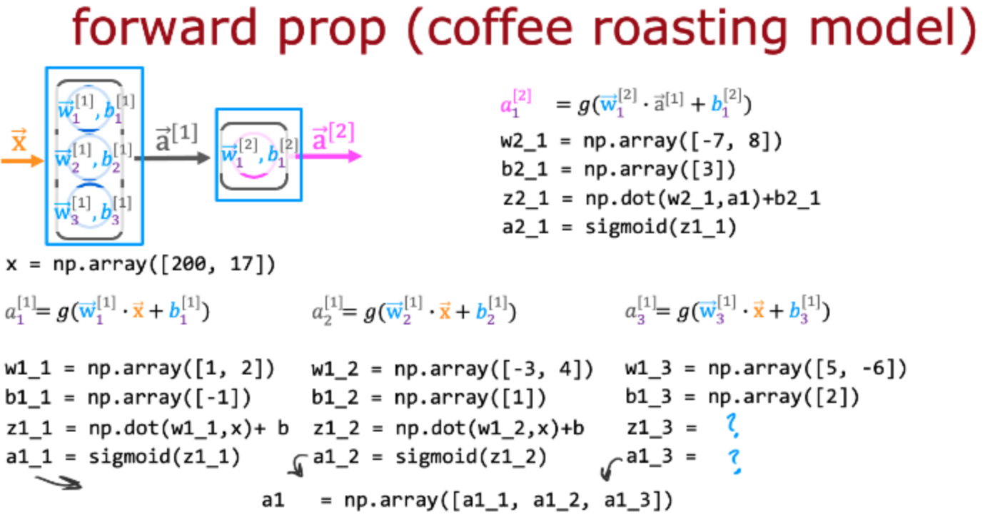
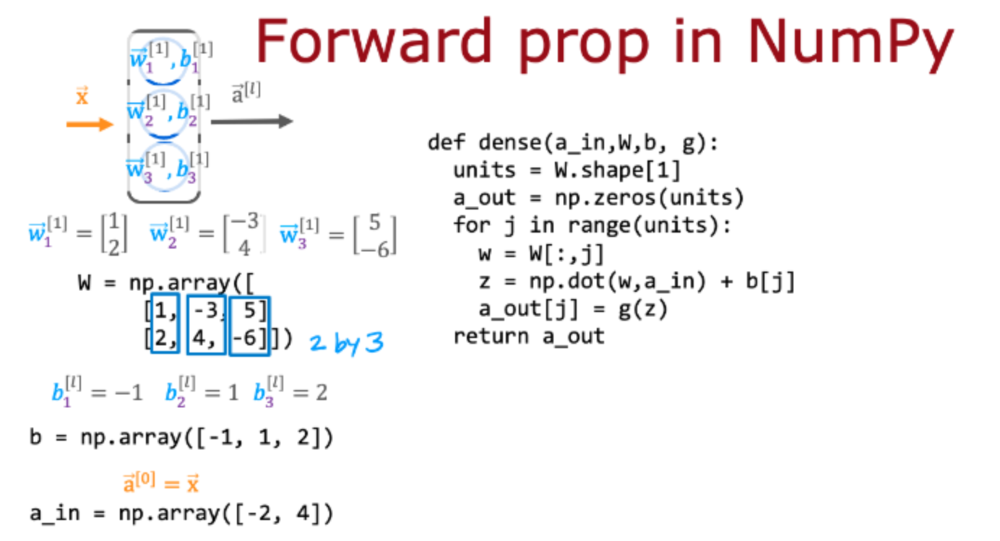
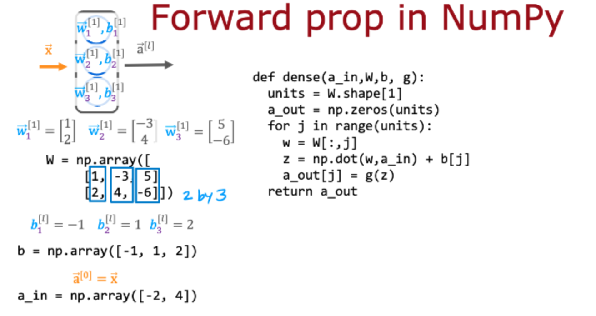

# 小测

## 第一题

根据讲座，如何使用NumPy计算第一层第三个神经元的激活？

- [x] `z1_3 = np.dot(w1_3, x) + b`

  `a1_3 = sigmoid(z1_3)`
- [ ] `z1_3 = w1_3 * x + b`

  `a1_3 =sigmoid(z1_3)`
- [ ] `layer_1 = Dense(units=3, activation='sigmoid')`

  `a_1= layer_1(x)`

## 第二题

根据讲座，在编写NumPy数组W时，您会将每个神经元的w参数放在哪里？

- [ ] 在W的行中。
- [x] 在W的专栏中。

## 第三题

对于上面定义单层神经元的“密集”函数中的代码，代码经过了多少次“for循环”？请注意，W有2行和3列。

- [x] 3次
- [ ] 5次