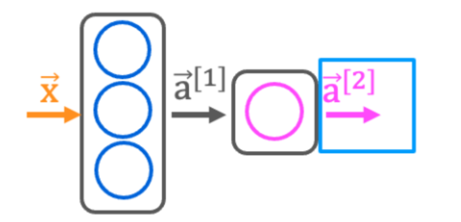
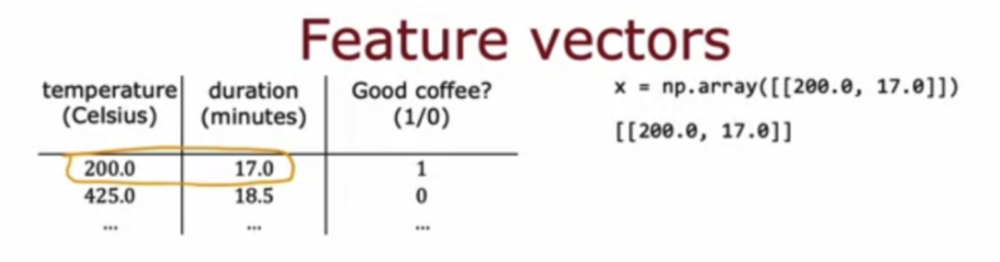

# 小测

## 第一题

对于以下代码：

```python
from tensorflow.keras.models import Sequential
from tensorflow.keras.layers import Dense

model = Sequential([Dense(units=25, activation="sigmoid"), Dense(units=15, activation="sigmoid"),
                    Dense(units=10, activation="sigmoid"), Dense(units=1, activation="sigmoid")])
```

这段代码将定义一个有多少层的神经网络？

- [ ] 5
- [x] 4
- [ ] 25
- [ ] 3

## 第二题



```python
import numpy as np
from tensorflow.keras.layers import Dense

x = np.array([[200.0, 17.0]])
layer_1 = Dense(units=3, activation='sigmoid')
a1 = layer_1(x)
layer_2 = Dense(units=1, activation='sigmoid')
a2 = layer_2(a1)
```

如何定义具有4个神经元和sigmoid激活的神经网络的第二层？

- [ ] `Dense(units=[4], activation=['sigmoid'])`
- [ ] `Dense(layer=2, units=4, activation = 'sigmoid")`
- [x] `Dense(units=4, activation='sigmoid")`
- [ ] `Dense(units=4)`

## 第三题



如果输入特征是温度（以摄氏度为单位）和持续时间（以分钟为单位），那么如何为上面显示的第一个特征向量x编写代码？

- [ ] `x = np.array([200.0], [17.0]])`
- [x] `x = np.array([200.0, 17.0]])`
- [ ] `x = np.array([200.0 + 17.0]])`
- [ ] `x = np.array([[200.0", '17.0']])`