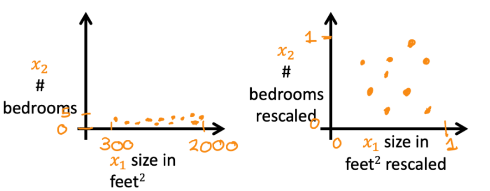
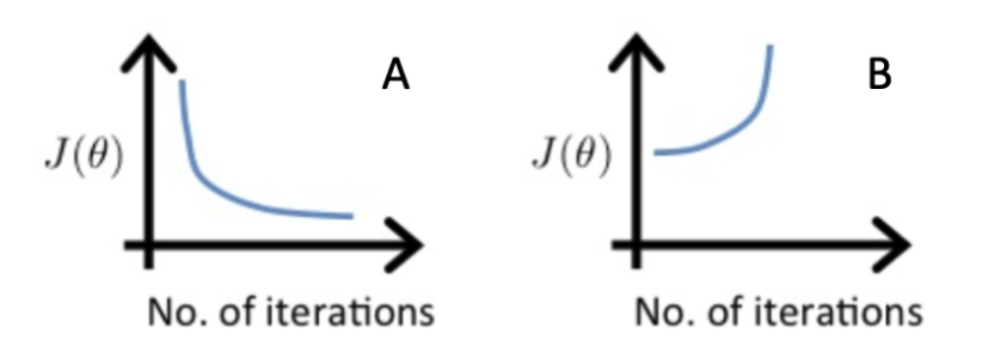

#小测

## 第一题

以下哪一项是特征缩放过程中使用的有效步骤？

- [ ] 将每个值的平均值相加，然后除以（最大值-最小值）。
- [x] 从每个值中减去平均值，然后除以（最大值-最小值）。

## 第二题

假设一位朋友使用三种学习率$\alpha$进行了三次梯度下降，并绘制了每次的学习曲线（每次迭代的成本$J$）。

对于哪种情况（A或B），学习率$\alpha$可能太大？

- [x] 只有B
- [ ] A和B
- [ ] 只有A
- [ ] 既不是A也不是B

## 第三题

在以下情况中，特征缩放对哪一种特别有帮助？

- [ ] 当原始数据中的所有特征（应用缩放之前）范围从 0 到 1 时，特征缩放很有用。
- [x] 当一个特征比另一特征大（或小）得多时，特征缩放很有帮助。

## 第四题

您正在帮助一家杂货店预测其收入，并了解其每周销售的商品以及每件商品的价格数据。什么可能是有用的工程功能？

- [x] 对于每种产品，计算已售出的商品数量乘以每件商品的价格。
- [ ] 对于每种产品，计算已售出的商品数量除以每件商品的价格。